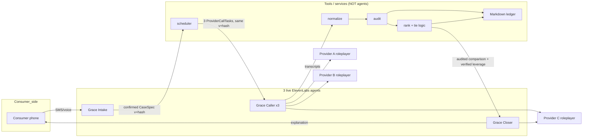
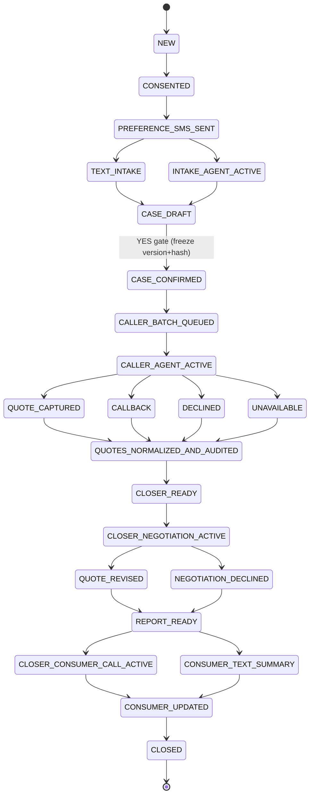

# Grace — Architecture (spec §3)

Grace is a family-controlled funeral-arrangements advocate. It gathers requirements,
calls providers with the **same confirmed brief**, obtains comparable itemized
quotes, negotiates within a pre-authorized honesty policy, ranks providers, and
reports back. **It never signs, pays, books, authorizes disposition, or transfers
remains** (INV-06).

> Jurisdiction: California. Synthetic data + pre-consented team members only. This is
> an engineering spec, **not legal advice**.

## 3.1 Runtime components

| Layer | Implementation |
|-------|----------------|
| 1. Consumer entry | Lovable consent/enrollment screen + Grace case dashboard. |
| 2. SMS | Twilio Programmable Messaging → Lovable Edge Function → Grace Intake text workflow. |
| 3. Intake voice | Twilio number → ElevenLabs **Grace Intake Agent** → confirmed CaseSpec. |
| 4. Caller voice | ElevenLabs **Grace Caller Agent** → Twilio → up to **three** allowlisted provider roleplayers in parallel. |
| 5. Closer voice | ElevenLabs **Grace Closer Agent** → provider negotiation call + optional consumer explanation call. |
| 6. Orchestrator | Event-driven Edge Functions dispatch agents at **stage boundaries**; **no general-purpose orchestrator agent**. |
| 7. Post-call | ElevenLabs transcription webhook → normalize/audit → quote store → closer-ready comparison. |
| 8. Evidence | Structured **database is canonical**; the Markdown case ledger is a **generated projection**. |
| 9. Research | Tavily only for **cached** official/fixture facts; **never on the live voice turn path**. |

## 3.2 Exactly three live voice agents + the boundary

There are **exactly three** live conversational agents. Everything else
(normalization, audit, scoring, scheduling, report assembly, the demo funeral homes)
is a **deterministic tool / service / human roleplayer** — **not** another agent
(INV-13, spec §12.4 "do not overbuild").

| Agent | Responsibility | Tools | Latency rule |
|-------|----------------|-------|--------------|
| **Grace Intake** | Consumer-facing intake + clarification; **produces and confirms CaseSpec**. | `get_case_context`, `patch_case_spec`, `confirm_case_spec`, `log_intake_event`, `end_call` | No handoff during intake; one blocking write only at checkpoints. |
| **Grace Caller** | Provider-facing **quote gathering** + clarification; one session per provider. | `get_provider_task`, `log_quote_item`, `mark_callback_or_decline`, `finalize_call_outcome`, `end_call` | **Up to 3 parallel** sessions; **no negotiation or ranking** here. |
| **Grace Closer** | Provider **negotiation** using audited leverage; consumer explanation of the ranked result/ties. | `get_audited_comparison`, `get_verified_leverage`, `log_revised_terms`, `get_ranked_report`, `save_consumer_decision`, `end_call` | Launched **only after audits**; **no live transfer** from Caller; **compact context only**. |

**Three-agent boundary.** The three agents have separate prompts, tool allowlists,
eval rubrics, and ElevenLabs agent IDs. No live agent receives the full ledger — each
pre-call webhook injects an **agent-specific compact context** (< 4,000 chars, §6.6):
Intake gets the CaseSpec draft + unresolved fields; Caller gets **one**
ProviderCallTask; Closer gets the audited comparison, verified leverage, permissions,
and last five material events. This preserves latency and prevents cross-stage
disclosure. The Caller **never** receives or cites competitor leverage (INV-11 /
prompt-injection boundary §10.1).

## 3.3 Event state machine (§3.3)

CaseSpec is confirmed once (immutable version + hash) before any provider call.
Terminal quote outcomes branch, then reconverge at normalization/audit.

(The `CaseStatus` union in `_shared/types.ts` is the canonical enumeration of these
states.)

## 3.4 Latency budget (§3.4)

| Path | Target | How |
|------|--------|-----|
| SMS inbound → reply | p50 < 3 s; p95 < 6 s | One OpenAI call; no web search; strict CasePatch + reply. |
| Voice turn | Perceived < 1.5 s | ElevenLabs hosted conversation; short prompts; **no agent transfer**. |
| Call launch after CALL | < 10 s | Immediate outbound API call; context precomputed. |
| Post-call quote | < 30 s | Webhook + one normalize/audit request; deterministic total check. |
| Three-call completion | < 12 min (demo mode) | Parallel up to 3; sequential fallback. |
| Final report | < 20 s after last audit | Deterministic scoring + one concise explanation request. |

## 3.5 Configuration, not code (§3.5)

Vertical-specific **questions, line-item taxonomy, ranking weights, red flags,
allowed negotiation asks, provider personas, and demo prices** live in **versioned
JSON** (`config/vertical.json`, `config/personas.json`, `config/disclosure.json`).
Voice prompts read this config through **dynamic variables** — **no per-provider
agent cloning** is permitted. ElevenLabs supports agent-transfer and workflow nodes,
but Grace P0 dispatches the three agents as **separate stage calls** rather than
transferring during a live call; this avoids inheriting irrelevant context and
reduces latency. To retune the demo, edit config JSON — not agent code.
